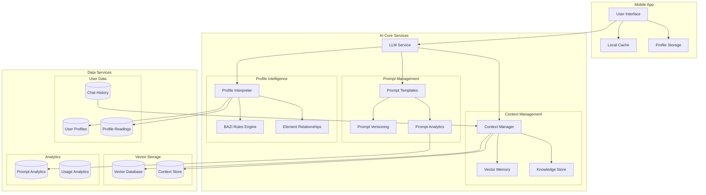

# BAZI AI System - AI & Data Architecture

## System Overview



## Component Details

### 1. AI Core Services

#### LLM Service
- **Model**: Google Gemini Pro
- **Features**:
  - Streaming responses
  - Context-aware conversations
  - Multi-turn dialogue
- **Scalability**:
  - Load balancing across multiple instances
  - Auto-scaling based on request volume
  - Request queuing for traffic spikes

#### Context Management
- **Context Manager**:
  ```python
  class ContextManager:
      def build_context(self, user_id: str) -> Context:
          profile = self.get_user_profile(user_id)
          recent_chats = self.get_recent_chats(user_id, limit=5)
          bazi_reading = self.get_current_reading(profile)
          
          return Context(
              profile=profile,
              chat_history=recent_chats,
              current_reading=bazi_reading,
              embeddings=self.get_relevant_embeddings(profile)
          )
  ```
- **Vector Memory**:
  - Stores embeddings of:
    * User profiles
    * Chat history
    * BAZI readings
    * Element relationships
  - Uses similarity search for context retrieval

#### Prompt Management
- **Template System**:
  ```python
  class PromptTemplate:
      def render(self, context: Context) -> str:
          return f"""
          Role: You are a BAZI Profile AI assistant
          Context: {context.format_for_llm()}
          User Profile: {context.profile.summary}
          Current Reading: {context.current_reading}
          Recent Interactions: {context.format_chat_history()}
          
          Task: {self.task_template}
          """
  ```
- **Version Control**:
  - Git-based prompt versioning
  - A/B testing capabilities
  - Performance tracking
- **Analytics**:
  - Response quality metrics
  - User satisfaction scores
  - Prompt effectiveness tracking

### 2. Profile Intelligence

#### BAZI Rules Engine
```python
class BaziRulesEngine:
    def analyze_profile(self, profile: Profile) -> Analysis:
        elements = self.extract_elements(profile)
        relationships = self.analyze_relationships(elements)
        strengths = self.calculate_strengths(elements)
        
        return Analysis(
            elements=elements,
            relationships=relationships,
            strengths=strengths,
            recommendations=self.generate_recommendations(profile)
        )
```

#### Element Relationships
- Dynamic relationship mapping
- Contextual interpretation
- Temporal influences

### 3. Data Services

#### User Profiles
```sql
CREATE TABLE user_profiles (
    user_id UUID PRIMARY KEY,
    birth_date TIMESTAMP,
    birth_location POINT,
    elements JSONB,
    readings JSONB[],
    preferences JSONB,
    created_at TIMESTAMP,
    updated_at TIMESTAMP
);

CREATE INDEX idx_elements ON user_profiles USING GIN (elements);
```

#### Chat History
```sql
CREATE TABLE chat_history (
    chat_id UUID PRIMARY KEY,
    user_id UUID,
    message TEXT,
    context JSONB,
    embeddings VECTOR(1536),
    timestamp TIMESTAMP,
    FOREIGN KEY (user_id) REFERENCES user_profiles(user_id)
);

CREATE INDEX idx_embeddings ON chat_history USING ivfflat (embeddings vector_cosine_ops);
```

## Scaling Strategy

### 1. AI Processing
- **Load Distribution**:
  ```mermaid
  graph TD
      LB[Load Balancer] --> LLM1[LLM Instance 1];
      LB --> LLM2[LLM Instance 2];
      LB --> LLM3[LLM Instance 3];
      
      LLM1 --> Cache1[Response Cache];
      LLM2 --> Cache1;
      LLM3 --> Cache1;
  ```

- **Caching Strategy**:
  ```python
  class ResponseCache:
      def get_cached_response(self, 
                            user_id: str, 
                            query: str, 
                            context_hash: str) -> Optional[str]:
          cache_key = self.generate_cache_key(user_id, query, context_hash)
          return self.redis.get(cache_key)
      
      def cache_response(self,
                        user_id: str,
                        query: str,
                        context_hash: str,
                        response: str,
                        ttl: int = 3600):
          cache_key = self.generate_cache_key(user_id, query, context_hash)
          self.redis.setex(cache_key, ttl, response)
  ```

### 2. Context Management
- **Tiered Storage**:
  ```mermaid
  graph TD
      A[Recent Context] --> B[Redis Cache];
      B --> C[Vector Store];
      C --> D[Cold Storage];
  ```

- **Context Pruning**:
  ```python
  class ContextPruner:
      def prune_context(self, context: Context) -> Context:
          relevant_messages = self.filter_relevant_messages(
              context.messages,
              context.current_topic
          )
          
          return Context(
              messages=relevant_messages,
              embeddings=self.update_embeddings(relevant_messages)
          )
  ```

## Monitoring & Analytics

### 1. Response Quality
```python
class ResponseAnalytics:
    def track_response(self,
                      prompt_id: str,
                      response: str,
                      user_feedback: Optional[int],
                      response_time: float):
        self.prometheus.histogram(
            'response_time_seconds',
            response_time,
            {'prompt_id': prompt_id}
        )
        
        if user_feedback:
            self.prometheus.gauge(
                'user_satisfaction',
                user_feedback,
                {'prompt_id': prompt_id}
            )
```

### 2. Usage Patterns
```sql
CREATE MATERIALIZED VIEW hourly_usage_stats AS
SELECT
    date_trunc('hour', timestamp) as hour,
    count(*) as request_count,
    avg(response_time) as avg_response_time,
    count(distinct user_id) as unique_users
FROM chat_history
GROUP BY 1;
```

## Security Measures

### 1. Data Protection
```python
class DataProtection:
    def encrypt_profile(self, profile: Dict) -> bytes:
        return self.fernet.encrypt(
            json.dumps(profile).encode()
        )
    
    def decrypt_profile(self, encrypted: bytes) -> Dict:
        return json.loads(
            self.fernet.decrypt(encrypted).decode()
        )
```

### 2. Access Control
```python
@dataclass
class AccessPolicy:
    user_id: str
    permissions: List[str]
    rate_limits: Dict[str, int]
    api_key: str
```

## Future Enhancements

### 1. Advanced Context Management
- Hierarchical context structures
- Long-term memory systems
- Cross-user pattern recognition

### 2. Prompt Engineering
- Dynamic prompt generation
- Contextual template selection
- Automated prompt optimization

### 3. Profile Analytics
- Pattern discovery
- Predictive insights
- Relationship mapping
