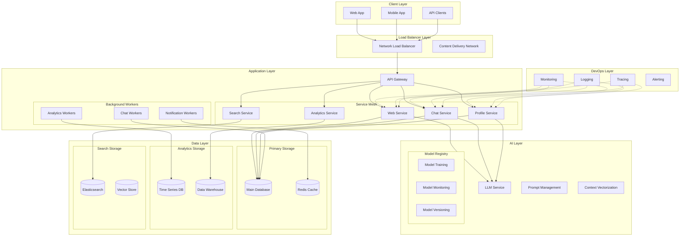
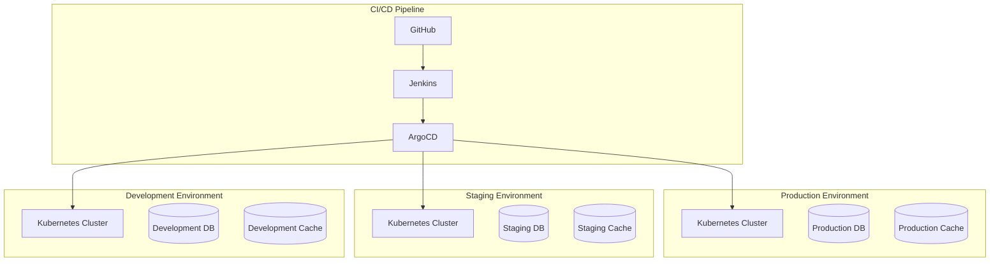

# BAZI AI System Architecture - Production Design

## System Overview

## Component Details

### 1. Client Layer
- **Web Application**
  - React-based SPA for desktop
  - Progressive Web App capabilities
  - WebSocket support for real-time updates
- **Mobile Application**
  - React Native for cross-platform support
  - Native push notifications
  - Offline capabilities
- **API Clients**
  - RESTful API access
  - GraphQL endpoint for complex queries
  - SDK support for major languages

### 2. Load Balancer Layer
- **Network Load Balancer**
  - AWS Network Load Balancer
  - SSL/TLS termination
  - DDoS protection
- **CDN**
  - CloudFront for static assets
  - Edge caching
  - Geographic distribution

### 3. Application Layer
- **API Gateway (AWS API Gateway)**
  - Request routing
  - Rate limiting
  - API key management
  - Request/response transformation

- **Service Mesh (Kubernetes + Istio)**
  - **Web Service**
    - FastAPI for high performance
    - Async request handling
    - Request validation
  - **Chat Service**
    - WebSocket management
    - Chat history tracking
    - Real-time message delivery
  - **Profile Service**
    - User profile management
    - BAZI calculations
    - Profile analytics
  - **Analytics Service**
    - User behavior tracking
    - Usage statistics
    - Performance metrics
  - **Search Service**
    - Full-text search
    - Vector similarity search
    - Query optimization

- **Background Workers (Celery)**
  - **Chat Workers**
    - Message processing
    - Context management
    - Response generation
  - **Analytics Workers**
    - Data aggregation
    - Report generation
    - Trend analysis
  - **Notification Workers**
    - Email notifications
    - Push notifications
    - Alert management

### 4. AI Layer
- **LLM Service**
  - Model API integration
  - Response streaming
  - Context management
- **Prompt Management**
  - Version control for prompts
  - A/B testing capabilities
  - Performance tracking
- **Context Vectorization**
  - Embedding generation
  - Semantic search
  - Context retrieval
- **Model Registry**
  - Model versioning
  - A/B testing
  - Performance monitoring

### 5. Data Layer
- **Primary Storage**
  - **Main Database (PostgreSQL)**
    - User profiles
    - Chat history
    - System configuration
  - **Cache (Redis)**
    - Session management
    - Real-time data
    - Rate limiting

- **Analytics Storage**
  - **Time Series DB (InfluxDB)**
    - Performance metrics
    - Usage statistics
    - System health
  - **Data Warehouse (Snowflake)**
    - Historical analysis
    - Business intelligence
    - Trend analysis

- **Search Storage**
  - **Elasticsearch**
    - Full-text search
    - Log aggregation
    - Analytics
  - **Vector Store (Pinecone)**
    - Embedding storage
    - Similarity search
    - Context indexing

### 6. DevOps Layer
- **Monitoring (Prometheus + Grafana)**
  - System metrics
  - Business metrics
  - Custom dashboards
- **Logging (ELK Stack)**
  - Centralized logging
  - Log analysis
  - Error tracking
- **Tracing (Jaeger)**
  - Distributed tracing
  - Performance analysis
  - Bottleneck identification
- **Alerting (PagerDuty)**
  - Alert management
  - On-call rotation
  - Incident response

## Deployment Architecture

## Scaling Strategy

### 1. Horizontal Scaling
- Auto-scaling based on metrics
- Regional deployment
- Load balancing across regions

### 2. Database Scaling
- Read replicas
- Sharding strategy
- Backup and recovery

### 3. Cache Strategy
- Multi-level caching
- Cache invalidation
- Cache warming

## Security Measures

### 1. Authentication & Authorization
- OAuth 2.0 / OpenID Connect
- JWT tokens
- Role-based access control

### 2. Data Security
- Encryption at rest
- Encryption in transit
- Key management

### 3. Network Security
- VPC configuration
- Security groups
- WAF rules

## Cost Optimization

### 1. Resource Management
- Auto-scaling policies
- Reserved instances
- Spot instances

### 2. Data Management
- Data lifecycle policies
- Storage tiering
- Backup retention

### 3. Performance Optimization
- Query optimization
- Caching strategies
- Resource allocation

## Disaster Recovery

### 1. Backup Strategy
- Automated backups
- Cross-region replication
- Point-in-time recovery

### 2. Recovery Plan
- RTO/RPO objectives
- Failover procedures
- Data consistency checks

## Future Considerations

### 1. AI/ML Pipeline
- Model retraining pipeline
- A/B testing framework
- Feature store implementation

### 2. Analytics Enhancement
- Real-time analytics
- Predictive analytics
- Custom reporting

### 3. Integration Capabilities
- API marketplace
- Partner integrations
- Custom connectors
