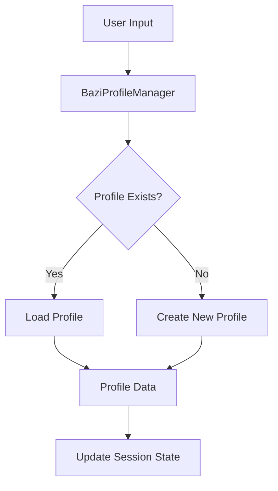
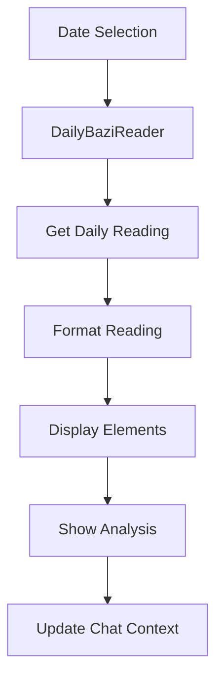
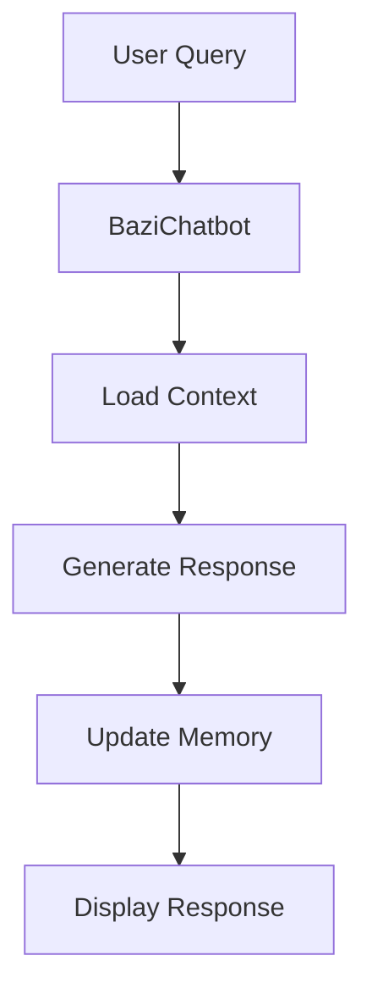

# BAZI Profile System - Flow Instructions

## Project Structure
```
BAZI/
├── src/
│   ├── bazi/
│   │   ├── __init__.py
│   │   ├── elements.py      # BAZI elements and relationships
│   │   ├── profile.py       # Profile management
│   │   └── daily_reading.py # Daily BAZI readings
│   ├── utils/
│   │   ├── __init__.py
│   │   └── date_utils.py    # Date handling utilities
│   ├── ui/
│   │   ├── __init__.py
│   │   └── styles.py        # UI components and styling
│   └── __init__.py
├── data/
│   └── daily_bazi.csv       # Daily BAZI readings data
├── profiles/                 # User profiles storage
├── .env                     # Environment configuration
├── main.py                  # Main Streamlit application
└── requirements.txt         # Project dependencies
```

## Component Flow

### 1. Profile Management


### 2. Daily BAZI Reading


### 3. Chat System


## Module Responsibilities

### 1. BAZI Core (src/bazi/)
- **elements.py**
  - Element relationship analysis
  - Element properties and characteristics
  - Five elements interaction rules

- **profile.py**
  - User profile CRUD operations
  - Profile data validation
  - Profile format standardization

- **daily_reading.py**
  - Daily BAZI calculations
  - Reading interpretation
  - Data formatting and presentation

### 2. Utilities (src/utils/)
- **date_utils.py**
  - Date parsing and validation
  - Timezone handling
  - Date format standardization

### 3. UI Components (src/ui/)
- **styles.py**
  - Custom CSS styling
  - UI component templates
  - Theme configuration

## Data Flow

1. **User Profile Creation**
   - Collect user information
   - Validate input data
   - Generate BAZI profile
   - Store profile data

2. **Daily Reading Process**
   - Load daily BAZI data
   - Calculate current influences
   - Generate personalized insights
   - Update chat context

3. **Chat Interaction**
   - Maintain conversation history
   - Process user queries
   - Generate contextual responses
   - Update conversation memory

## Environment Setup

1. **Required Environment Variables**
   ```
   GOOGLE_API_KEY=your_api_key
   ```

2. **Dependencies Installation**
   ```bash
   pip install -r requirements.txt
   ```

## Development Guidelines

1. **Code Organization**
   - Keep modules focused and single-responsibility
   - Use type hints for better code clarity
   - Document all public functions and classes
   - Follow PEP 8 style guide

2. **Error Handling**
   - Use try-except blocks for data operations
   - Provide meaningful error messages
   - Log errors for debugging
   - Graceful fallback for missing data

3. **State Management**
   - Use Streamlit session state for persistence
   - Clear separation of UI and business logic
   - Maintain chat context efficiently
   - Handle memory cleanup

4. **Performance Considerations**
   - Cache expensive calculations
   - Optimize data loading
   - Minimize API calls
   - Handle large profiles efficiently

## Testing Strategy

1. **Unit Tests**
   - Test individual components
   - Mock external dependencies
   - Validate calculations
   - Check error handling

2. **Integration Tests**
   - Test component interactions
   - Verify data flow
   - Check state management
   - Test UI updates

3. **End-to-End Tests**
   - Test complete user flows
   - Verify chat functionality
   - Check profile management
   - Test daily reading updates
