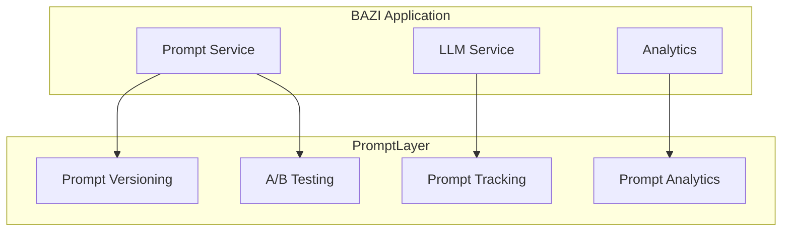

# BAZI AI - PromptLayer Integration

## Overview
PromptLayer serves as our prompt management and optimization platform, providing:
- Version control for prompts
- A/B testing capabilities
- Performance tracking
- Cost monitoring
- Prompt analytics

## Integration Architecture



## Implementation

### 1. PromptLayer Setup
```python
import promptlayer
import google.generativeai as genai

# Initialize PromptLayer
promptlayer.api_key = "pl_YOUR_API_KEY"

# Wrap Google Gemini with PromptLayer
genai = promptlayer.google.generativeai

class PromptLayerService:
    def __init__(self):
        self.genai = genai
        self.model = self.genai.GenerativeModel("gemini-pro")
        
    async def track_prompt(self, 
                         prompt: str,
                         response: str,
                         metadata: dict,
                         tags: list[str]) -> None:
        """Track prompt and response in PromptLayer"""
        promptlayer.track.prompt(
            prompt=prompt,
            response=response,
            request_start_time=time.time(),
            request_end_time=time.time(),
            metadata=metadata,
            tags=tags
        )
```

### 2. Prompt Version Management
```python
class PromptVersionManager:
    def __init__(self, promptlayer_client):
        self.pl = promptlayer_client
        
    async def get_prompt_template(self, 
                                template_name: str,
                                version: str = "latest") -> str:
        """Get prompt template from PromptLayer"""
        return await self.pl.prompts.get(
            template_name,
            version=version
        )
    
    async def publish_template(self,
                             template_name: str,
                             template: str,
                             metadata: dict) -> None:
        """Publish new prompt template version"""
        await self.pl.prompts.publish(
            name=template_name,
            prompt=template,
            metadata=metadata
        )
```

### 3. A/B Testing
```python
class PromptABTesting:
    def __init__(self, promptlayer_client):
        self.pl = promptlayer_client
        
    async def get_test_variant(self, 
                             test_name: str,
                             user_id: str) -> str:
        """Get A/B test variant for user"""
        return await self.pl.ab_tests.get_variant(
            test_name=test_name,
            user_id=user_id
        )
    
    async def track_test_result(self,
                              test_name: str,
                              variant: str,
                              user_id: str,
                              success: bool) -> None:
        """Track A/B test result"""
        await self.pl.ab_tests.track_result(
            test_name=test_name,
            variant=variant,
            user_id=user_id,
            success=success
        )
```

### 4. Analytics Integration
```python
class PromptAnalytics:
    def __init__(self, promptlayer_client):
        self.pl = promptlayer_client
        
    async def get_prompt_metrics(self,
                               template_name: str,
                               start_date: str,
                               end_date: str) -> dict:
        """Get metrics for prompt template"""
        return await self.pl.analytics.get_metrics(
            prompt_name=template_name,
            start_date=start_date,
            end_date=end_date
        )
    
    async def get_cost_analysis(self,
                              template_name: str,
                              timeframe: str = "7d") -> dict:
        """Get cost analysis for prompt template"""
        return await self.pl.analytics.get_costs(
            prompt_name=template_name,
            timeframe=timeframe
        )
```

## BAZI-Specific Prompt Templates

### 1. Profile Analysis Template
```python
PROFILE_ANALYSIS_TEMPLATE = """
Role: You are a BAZI Profile AI assistant analyzing a user's profile.

Context:
- Birth Details: {birth_details}
- Elements: {elements}
- Current Reading: {current_reading}

Instructions:
1. Analyze the relationship between elements
2. Identify key strengths and challenges
3. Provide personalized insights
4. Suggest potential opportunities

Previous Analysis: {previous_analysis}

Query: {user_query}
"""

# Track in PromptLayer
promptlayer.track.prompt(
    prompt=PROFILE_ANALYSIS_TEMPLATE,
    name="profile_analysis",
    version="1.0",
    metadata={
        "category": "profile",
        "use_case": "analysis",
        "language": "en"
    }
)
```

### 2. Daily Reading Template
```python
DAILY_READING_TEMPLATE = """
Role: You are a BAZI Daily Reading assistant.

User Profile:
{user_profile}

Today's Elements:
{daily_elements}

Historical Context:
{recent_readings}

Instructions:
1. Analyze today's element interactions
2. Compare with user's base profile
3. Identify opportunities and challenges
4. Provide actionable recommendations

Query: {user_query}
"""

# Track in PromptLayer
promptlayer.track.prompt(
    prompt=DAILY_READING_TEMPLATE,
    name="daily_reading",
    version="1.0",
    metadata={
        "category": "reading",
        "use_case": "daily",
        "language": "en"
    }
)
```

## Monitoring and Optimization

### 1. Performance Tracking
```python
class PromptPerformanceTracker:
    def __init__(self, promptlayer_client):
        self.pl = promptlayer_client
        
    async def track_response_quality(self,
                                   prompt_id: str,
                                   response: str,
                                   user_feedback: int,
                                   metadata: dict) -> None:
        """Track response quality and user feedback"""
        await self.pl.track.response_quality(
            prompt_id=prompt_id,
            response=response,
            quality_score=user_feedback,
            metadata=metadata
        )
    
    async def get_performance_report(self,
                                   template_name: str,
                                   timeframe: str = "30d") -> dict:
        """Get performance report for prompt template"""
        return await self.pl.analytics.get_performance(
            prompt_name=template_name,
            timeframe=timeframe
        )
```

### 2. Cost Optimization
```python
class PromptCostOptimizer:
    def __init__(self, promptlayer_client):
        self.pl = promptlayer_client
        
    async def analyze_token_usage(self,
                                template_name: str) -> dict:
        """Analyze token usage for optimization"""
        return await self.pl.analytics.get_token_usage(
            prompt_name=template_name
        )
    
    async def get_cost_recommendations(self,
                                     template_name: str) -> list:
        """Get cost optimization recommendations"""
        return await self.pl.recommendations.get_cost_optimizations(
            prompt_name=template_name
        )
```

## Development Workflow

1. **Template Development**
   ```bash
   # Create new template version
   python scripts/create_prompt.py \
       --name "profile_analysis" \
       --template "templates/profile_analysis.txt" \
       --version "2.0"
   ```

2. **A/B Testing Setup**
   ```bash
   # Create A/B test
   python scripts/create_ab_test.py \
       --name "profile_analysis_test" \
       --variant-a "templates/variant_a.txt" \
       --variant-b "templates/variant_b.txt" \
       --duration "14d"
   ```

3. **Performance Analysis**
   ```bash
   # Generate performance report
   python scripts/analyze_prompts.py \
       --template "profile_analysis" \
       --timeframe "30d" \
       --output "reports/performance.pdf"
   ```

## Best Practices

1. **Version Control**
   - Use semantic versioning for templates
   - Include changelog in template metadata
   - Tag templates with relevant categories

2. **Testing**
   - Run A/B tests for significant changes
   - Collect user feedback systematically
   - Monitor performance metrics

3. **Optimization**
   - Regularly review token usage
   - Optimize based on cost analysis
   - Update templates based on performance data

4. **Documentation**
   - Document template purpose and usage
   - Track changes and rationale
   - Maintain prompt engineering guidelines
