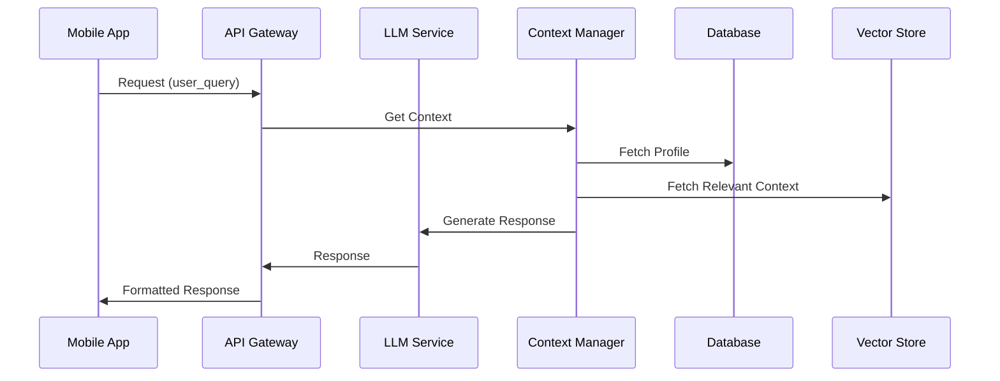
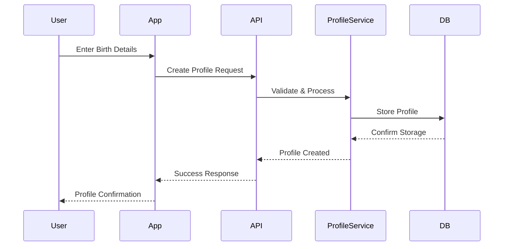
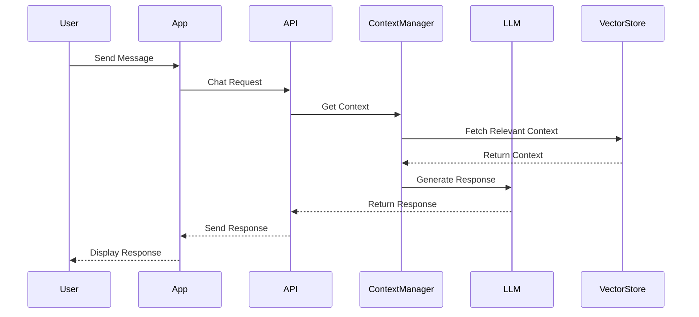
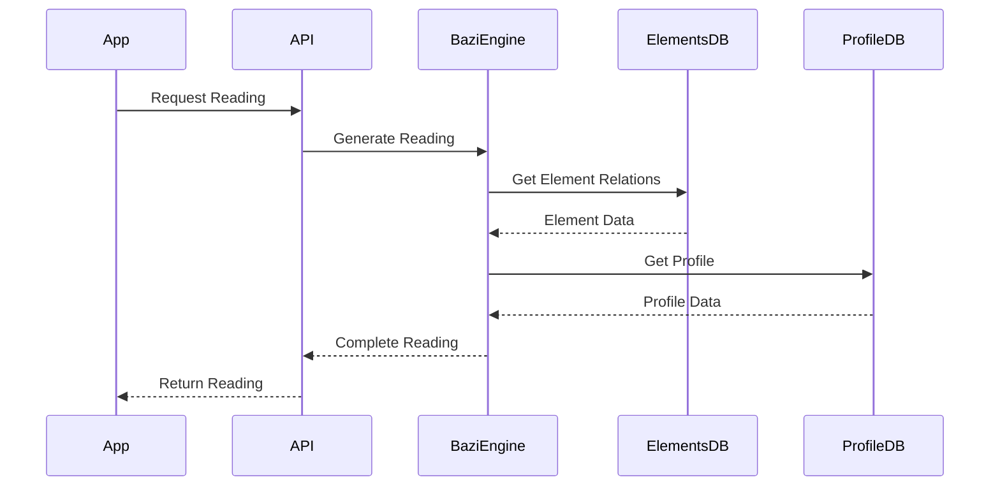

# BAZI AI System - Technical Specification

## Table of Contents
1. [System Overview](#system-overview)
2. [Technology Stack](#technology-stack)
3. [Core Processes](#core-processes)
4. [Detailed Component Specifications](#detailed-component-specifications)
5. [Deployment Guide](#deployment-guide)
6. [Development Setup](#development-setup)

## System Overview

### High-Level Architecture


## Technology Stack

### 1. Frontend Technologies
- **Mobile App Framework**: React Native v0.72+
  ```json
  {
    "dependencies": {
      "react-native": "^0.72.0",
      "react-navigation": "^6.0.0",
      "@react-native-async-storage/async-storage": "^1.19.0",
      "@react-native-firebase/app": "^18.0.0",
      "@react-native-firebase/auth": "^18.0.0"
    }
  }
  ```

### 2. Backend Services
- **API Framework**: FastAPI v0.100+
  ```python
  requirements = [
      "fastapi==0.100.0",
      "uvicorn==0.22.0",
      "gunicorn==20.1.0",
      "pydantic==2.0.0"
  ]
  ```

- **Database**: PostgreSQL 15+
  ```sql
  -- Example schema initialization
  CREATE EXTENSION IF NOT EXISTS "uuid-ossp";
  CREATE EXTENSION IF NOT EXISTS "vector";
  ```

- **Vector Store**: Pinecone
  ```python
  requirements = [
      "pinecone-client==2.2.1",
      "sentence-transformers==2.2.2"
  ]
  ```

### 3. AI Components
- **LLM Service**: Google Gemini Pro
  ```python
  requirements = [
      "google-generativeai==0.3.0",
      "langchain==0.1.0",
      "transformers==4.30.0"
  ]
  ```

### 4. Infrastructure
- **Container Orchestration**: Kubernetes v1.26+
- **Cloud Provider**: Google Cloud Platform
- **CI/CD**: GitHub Actions

## Core Processes

### 1. User Profile Creation


### 2. Chat Interaction


### 3. BAZI Reading Generation


## Detailed Component Specifications

### 1. Profile Management System

#### Database Schema
```sql
-- User Profiles
CREATE TABLE user_profiles (
    id UUID PRIMARY KEY DEFAULT uuid_generate_v4(),
    birth_datetime TIMESTAMP WITH TIME ZONE NOT NULL,
    birth_location POINT,
    name VARCHAR(255),
    email VARCHAR(255) UNIQUE,
    created_at TIMESTAMP WITH TIME ZONE DEFAULT CURRENT_TIMESTAMP,
    updated_at TIMESTAMP WITH TIME ZONE DEFAULT CURRENT_TIMESTAMP
);

-- BAZI Elements
CREATE TABLE bazi_elements (
    id UUID PRIMARY KEY DEFAULT uuid_generate_v4(),
    profile_id UUID REFERENCES user_profiles(id),
    year_pillar JSONB,
    month_pillar JSONB,
    day_pillar JSONB,
    hour_pillar JSONB,
    created_at TIMESTAMP WITH TIME ZONE DEFAULT CURRENT_TIMESTAMP
);

-- Chat History
CREATE TABLE chat_history (
    id UUID PRIMARY KEY DEFAULT uuid_generate_v4(),
    profile_id UUID REFERENCES user_profiles(id),
    message TEXT NOT NULL,
    embedding VECTOR(1536),
    metadata JSONB,
    created_at TIMESTAMP WITH TIME ZONE DEFAULT CURRENT_TIMESTAMP
);
```

#### Profile Service Implementation
```python
class ProfileService:
    def __init__(self, db: Database, vector_store: VectorStore):
        self.db = db
        self.vector_store = vector_store
    
    async def create_profile(self, profile_data: ProfileCreate) -> Profile:
        # Validate birth data
        validated_data = await self.validate_birth_data(profile_data)
        
        # Calculate BAZI elements
        elements = await self.calculate_bazi_elements(validated_data)
        
        # Store profile
        profile_id = await self.db.create_profile(validated_data)
        await self.db.create_elements(profile_id, elements)
        
        # Create embeddings
        await self.vector_store.create_profile_embedding(profile_id, elements)
        
        return await self.db.get_profile(profile_id)
```

### 2. Context Management System

#### Context Manager Implementation
```python
class ContextManager:
    def __init__(self, 
                 vector_store: VectorStore,
                 profile_service: ProfileService,
                 chat_service: ChatService):
        self.vector_store = vector_store
        self.profile_service = profile_service
        self.chat_service = chat_service
    
    async def build_context(self, 
                          user_id: str, 
                          query: str) -> Context:
        # Get user profile
        profile = await self.profile_service.get_profile(user_id)
        
        # Get relevant chat history
        chat_history = await self.chat_service.get_recent_chats(
            user_id, limit=5
        )
        
        # Get similar contexts
        similar_contexts = await self.vector_store.similarity_search(
            query, k=3
        )
        
        # Build context object
        return Context(
            profile=profile,
            chat_history=chat_history,
            similar_contexts=similar_contexts,
            current_query=query
        )
```

### 3. LLM Integration

#### Prompt Management
```python
class PromptManager:
    def __init__(self, template_store: TemplateStore):
        self.template_store = template_store
    
    async def build_prompt(self, 
                         context: Context, 
                         template_name: str) -> str:
        template = await self.template_store.get_template(template_name)
        
        return template.format(
            profile=context.profile,
            chat_history=context.format_chat_history(),
            similar_contexts=context.format_similar_contexts(),
            query=context.current_query
        )
```

#### LLM Service
```python
class LLMService:
    def __init__(self, 
                 model: str = "gemini-pro",
                 temperature: float = 0.7):
        self.genai = google.generativeai
        self.model = self.genai.GenerativeModel(model)
        self.temperature = temperature
    
    async def generate_response(self, 
                              prompt: str, 
                              context: Context) -> str:
        response = await self.model.generate_content(
            prompt,
            generation_config={
                "temperature": self.temperature,
                "top_p": 0.8,
                "top_k": 40
            }
        )
        
        return response.text
```

## Deployment Guide

### 1. Infrastructure Setup

#### Kubernetes Configuration
```yaml
# app-deployment.yaml
apiVersion: apps/v1
kind: Deployment
metadata:
  name: bazi-api
spec:
  replicas: 3
  selector:
    matchLabels:
      app: bazi-api
  template:
    metadata:
      labels:
        app: bazi-api
    spec:
      containers:
      - name: api
        image: bazi-api:latest
        resources:
          requests:
            memory: "256Mi"
            cpu: "200m"
          limits:
            memory: "512Mi"
            cpu: "500m"
        env:
        - name: DATABASE_URL
          valueFrom:
            secretKeyRef:
              name: bazi-secrets
              key: database-url
```

#### Database Migration
```bash
# Initialize database
psql -U postgres -f init.sql

# Run migrations
alembic upgrade head
```

### 2. CI/CD Pipeline

#### GitHub Actions Workflow
```yaml
name: BAZI AI CI/CD

on:
  push:
    branches: [ main ]
  pull_request:
    branches: [ main ]

jobs:
  test:
    runs-on: ubuntu-latest
    steps:
    - uses: actions/checkout@v2
    - name: Set up Python
      uses: actions/setup-python@v2
      with:
        python-version: '3.10'
    - name: Install dependencies
      run: |
        python -m pip install --upgrade pip
        pip install -r requirements.txt
    - name: Run tests
      run: |
        pytest

  deploy:
    needs: test
    runs-on: ubuntu-latest
    steps:
    - name: Deploy to GCP
      uses: google-github-actions/deploy-cloudrun@v0
      with:
        service: bazi-api
        region: us-west1
        credentials: ${{ secrets.GCP_SA_KEY }}
```

## Development Setup

### 1. Local Environment
```bash
# Create virtual environment
python -m venv venv
source venv/bin/activate  # or `venv\Scripts\activate` on Windows

# Install dependencies
pip install -r requirements.txt

# Set up environment variables
cp .env.example .env
# Edit .env with your credentials

# Start services
docker-compose up -d  # Starts PostgreSQL and Redis
uvicorn app.main:app --reload  # Starts API server
```

### 2. Testing
```bash
# Run tests
pytest

# Run with coverage
pytest --cov=app tests/

# Generate coverage report
coverage html
```

### 3. Mobile App Development
```bash
# Install dependencies
npm install

# Start Metro bundler
npx react-native start

# Run on Android
npx react-native run-android

# Run on iOS
npx react-native run-ios
```

## Performance Optimization

### 1. Caching Strategy
```python
class CacheManager:
    def __init__(self, redis_client: Redis):
        self.redis = redis_client
    
    async def get_cached_response(self, 
                                user_id: str, 
                                query_hash: str) -> Optional[str]:
        return await self.redis.get(f"response:{user_id}:{query_hash}")
    
    async def cache_response(self,
                           user_id: str,
                           query_hash: str,
                           response: str,
                           ttl: int = 3600):
        await self.redis.setex(
            f"response:{user_id}:{query_hash}",
            ttl,
            response
        )
```

### 2. Load Balancing
```yaml
# ingress.yaml
apiVersion: networking.k8s.io/v1
kind: Ingress
metadata:
  name: bazi-ingress
  annotations:
    kubernetes.io/ingress.class: "nginx"
    nginx.ingress.kubernetes.io/ssl-redirect: "true"
spec:
  rules:
  - host: api.bazi.ai
    http:
      paths:
      - path: /
        pathType: Prefix
        backend:
          service:
            name: bazi-api
            port:
              number: 80
```

## Security Measures

### 1. API Security
```python
class SecurityConfig:
    def __init__(self):
        self.oauth2_scheme = OAuth2PasswordBearer(tokenUrl="token")
        self.pwd_context = CryptContext(schemes=["bcrypt"], deprecated="auto")
    
    def verify_password(self, plain_password: str, hashed_password: str) -> bool:
        return self.pwd_context.verify(plain_password, hashed_password)
    
    def get_password_hash(self, password: str) -> str:
        return self.pwd_context.hash(password)
```

### 2. Data Encryption
```python
class DataEncryption:
    def __init__(self, key: bytes):
        self.fernet = Fernet(key)
    
    def encrypt_profile_data(self, data: dict) -> bytes:
        return self.fernet.encrypt(json.dumps(data).encode())
    
    def decrypt_profile_data(self, encrypted_data: bytes) -> dict:
        return json.loads(self.fernet.decrypt(encrypted_data).decode())
```

## Monitoring and Analytics

### 1. Prometheus Metrics
```python
class MetricsCollector:
    def __init__(self):
        self.request_latency = Histogram(
            'request_latency_seconds',
            'Request latency in seconds',
            ['endpoint']
        )
        self.response_size = Histogram(
            'response_size_bytes',
            'Response size in bytes',
            ['endpoint']
        )
```

### 2. Logging Configuration
```python
class LogConfig:
    def __init__(self):
        self.logger = logging.getLogger("bazi_ai")
        self.logger.setLevel(logging.INFO)
        
        handler = logging.StreamHandler()
        handler.setFormatter(
            logging.Formatter(
                '%(asctime)s - %(name)s - %(levelname)s - %(message)s'
            )
        )
        self.logger.addHandler(handler)
```

## Future Considerations

### 1. Scaling Strategies
- Implement horizontal pod autoscaling
- Set up geographic distribution
- Implement cross-region replication

### 2. Feature Roadmap
- Multi-language support
- Advanced analytics dashboard
- Automated testing framework
- Performance optimization suite
